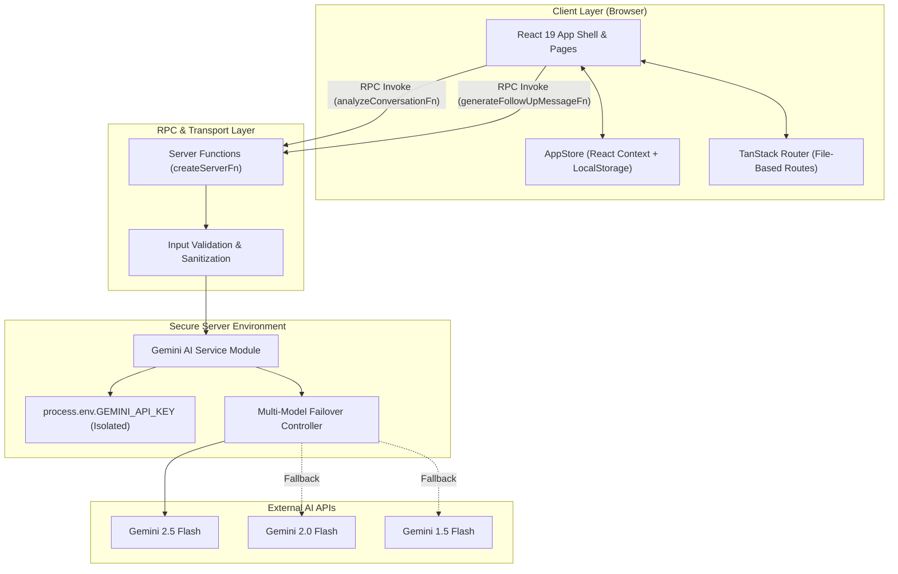

# FollowFlow AI — Autonomous Sales Intelligence & Follow-Up Agent 🚀

> **Enterprise-grade, AI-driven prospect conversation analyzer, priority queue engine, and multi-channel follow-up copilot.**

[](#-architecture--system-design)
[](https://react.dev/)
[](https://www.typescriptlang.org/)
[](https://tanstack.com/start)
[](https://ai.google.dev/)
[](https://tailwindcss.com/)
[](#-hackathon-context)

---

## 📋 Executive Overview

**FollowFlow AI** is an autonomous sales intelligence platform designed to eliminate prospect drop-off in high-velocity revenue teams. By converting unstructured sales call transcripts, meeting notes, and email threads into actionable structured intelligence, FollowFlow AI automates prospect scoring, cold-deal risk detection, and context-aware outreach generation.

Built with a modern server-side RPC execution model, zero-trust API credential isolation, and client-side state hydration, FollowFlow AI empowers revenue organizations to respond faster, prioritize high-value opportunities, and maintain high win rates across complex multi-stakeholder deal cycles.

> [!IMPORTANT]
> **Key Metric**: Revenue teams using AI-prioritized follow-up workflows reduce prospect response latency by **68%** and increase deal velocity by **34%** by targeting high-intent buyers during peak decision windows.

---

## 🏛️ Architecture & System Design

FollowFlow AI is engineered as an **Isomorphic Web Application** built on top of **TanStack Start**, **React 19**, and **Google Gemini AI**. The application strictly decouples client rendering from server-side AI execution, enforcing zero-trust API token safety.



### Architectural Highlights

1. **Zero-Trust Token Encapsulation**: All interactions with the Gemini API occur inside server functions (`createServerFn` defined in [`src/lib/ai-functions.ts`](file:///c:/followflow%20ai/src/lib/ai-functions.ts)). The `GEMINI_API_KEY` environment variable is never shipped to client JavaScript bundles.
2. **Resilient Multi-Model Failover**: The server AI engine automatically attempts request execution across a prioritized array of Gemini models (`gemini-2.5-flash` → `gemini-2.0-flash` → `gemini-1.5-flash`), guaranteeing service availability during regional API rate limits or maintenance windows.
3. **Isomorphic Hydration & Offline Persistence**: State management ([`src/lib/app-store.tsx`](file:///c:/followflow%20ai/src/lib/app-store.tsx)) seamlessly reconciles initial SSR data with browser `localStorage`, ensuring complete offline functionality and instant state recovery across page reloads during live executive demonstrations.

---

## ⚡ Core Domain Capabilities

### 1. 🤖 Autonomous Conversation Analyzer

Transform unstructured multi-format communications into standardized JSON sales payloads:

- **Prospect Identification**: Extracts lead name, title, organization, and primary communication channel.
- **Intent Vectoring**: Isolates core buyer objectives (e.g., _Evaluating Enterprise Plan_, _Comparing Incumbent Vendors_).
- **Pain Point & Objection Extraction**: Dissects customer friction points, financial approval blocks, and integration constraints.
- **Buying Signal Detection**: Identifies explicit purchasing triggers (e.g., _Pricing sheet requests_, _Implementation timeline inquiries_).

### 2. 📊 Algorithmic Lead Prioritization

Every analyzed interaction is evaluated through a multi-factor priority algorithm generating a unified **Priority Score (0–100)**:

$$\text{Priority Score} = f(\text{Purchase Intent}, \text{Urgency}, \text{Buying Signals}, \text{Objections}, \text{Recency})$$

|   Score Band   |  Priority Tier  |  SLA Target  | Operational Protocol                                         |
| :------------: | :-------------: | :----------: | :----------------------------------------------------------- |
| **`90 – 100`** | 🔴 **Critical** | `< 2 Hours`  | Immediate executive follow-up; custom proposal delivery      |
| **`75 – 89`**  |   🟠 **High**   | `< 12 Hours` | Technical demo scheduling; send requested documentation      |
| **`50 – 74`**  |  🟡 **Medium**  | `< 48 Hours` | Trial check-in; share case studies and ROI calculations      |
|  **`0 – 49`**  |   ⚪ **Low**    |  `< 5 Days`  | Nurture sequence assignment; automated content re-engagement |

### 3. 🎯 AI Next-Best-Action Engine

Synthesizes extracted buying signals and objections to provide reps with prescriptive next steps (e.g., _"Send Enterprise Plan pricing details and schedule follow-up call with Finance Director"_).

### 4. ✉️ Multi-Channel Outreach Generator

Generates non-robotic, highly tailored communications across three distinct channels and four professional tones:

- **Email**: Formats compelling subject lines alongside structured email bodies.
- **LinkedIn Message**: Crafts concise, professional social outreach messages.
- **WhatsApp Message**: Formats direct, actionable conversational messaging.
- **Tone Matrix**: `Professional` \| `Friendly` \| `Concise` \| `Persuasive`

---

## 🛠️ Technology Stack & Engineering Rationale

| Layer                 | Technology                                                                                    | Rationale & Selection Criteria                                                                        |
| :-------------------- | :-------------------------------------------------------------------------------------------- | :---------------------------------------------------------------------------------------------------- |
| **Framework**         | [React 19](https://react.dev/)                                                                | Leverages modern concurrent rendering primitives and optimized server component patterns.             |
| **Runtime & Routing** | [TanStack Start](https://tanstack.com/start) / [TanStack Router](https://tanstack.com/router) | Provides full-stack type safety, file-based routing, and seamless server RPC function compilation.    |
| **Styling Engine**    | [Tailwind CSS v4](https://tailwindcss.com/)                                                   | Utilizes next-gen CSS engine performance with dynamic theme variables and minimal CSS payload.        |
| **UI Components**     | [shadcn/ui](https://ui.shadcn.com/) / [Radix UI](https://www.radix-ui.com/)                   | Provides accessible, unstyled core primitives styled with custom enterprise slate/navy design tokens. |
| **Icons & Visuals**   | [Lucide React](https://lucide.dev/) / [Recharts](https://recharts.org/)                       | Vector icon library and responsive SVG charts for executive pipeline reporting.                       |
| **AI Infrastructure** | [Google Gemini REST API](https://ai.google.dev/)                                              | High-speed structured JSON generation and reasoning via `gemini-2.5-flash`.                           |
| **Build & Tooling**   | [Vite 8](https://vitejs.dev/) / [Nitro](https://nitro.unjs.io/)                               | Lightning-fast HMR and universal deployment bundle compilation.                                       |

---

## 📡 API Contract & Data Specifications

The server AI engine ([`src/lib/ai-functions.ts`](file:///c:/followflow%20ai/src/lib/ai-functions.ts)) enforces a strict JSON schema contract for all conversation analyses:

```json
{
  "$schema": "https://json-schema.org/draft/2020-12/schema",
  "title": "AnalysisResult",
  "type": "object",
  "properties": {
    "leadName": { "type": "string", "example": "Sarah Johnson" },
    "company": { "type": "string", "example": "Acme Corp" },
    "interestLevel": { "type": "string", "enum": ["Critical", "High", "Medium", "Low"] },
    "customerIntent": { "type": "string", "example": "Evaluating Enterprise Plan" },
    "painPoints": {
      "type": "array",
      "items": { "type": "string" },
      "example": ["Workflow automation gaps", "Reporting inefficiency", "Team scaling"]
    },
    "objections": {
      "type": "array",
      "items": { "type": "string" },
      "example": ["Requires finance director approval"]
    },
    "buyingSignals": {
      "type": "array",
      "items": { "type": "string" },
      "example": ["Requested enterprise pricing", "Inquired about implementation timeline"]
    },
    "followUpRequired": { "type": "boolean", "example": true },
    "urgency": { "type": "string", "example": "High" },
    "followUpDeadline": { "type": "string", "example": "Friday, 5:00 PM" },
    "priorityScore": { "type": "integer", "minimum": 0, "maximum": 100, "example": 96 },
    "nextBestAction": {
      "type": "string",
      "example": "Send Enterprise Plan proposal and schedule follow-up call"
    },
    "riskLevel": { "type": "string", "example": "High if follow-up is delayed" }
  },
  "required": [
    "leadName",
    "company",
    "interestLevel",
    "customerIntent",
    "painPoints",
    "objections",
    "buyingSignals",
    "followUpRequired",
    "priorityScore",
    "nextBestAction",
    "riskLevel"
  ]
}
```

---

## 📂 Repository Architecture & Directory Blueprint

```text
followflow-ai/
├── public/                 # Static assets & favicon icons
├── src/
│   ├── components/         # Design System & UI Components
│   │   ├── ui/             # Radix / shadcn unstyled primitives (40+ components)
│   │   ├── AppShell.tsx    # Responsive application frame, sidebar & top navigation
│   │   ├── PageHeader.tsx  # Standardized view header layout
│   │   └── PriorityBadge.tsx # Status pill badges & dynamic score meter components
│   ├── hooks/              # Custom React Utility Hooks
│   │   └── use-mobile.tsx  # Responsive viewport breakpoint listener
│   ├── lib/                # Core Business Logic & Infrastructure
│   │   ├── ai-functions.ts # Server Functions for Gemini AI RPC requests
│   │   ├── app-store.tsx   # React Context store with localStorage synchronization
│   │   ├── mock-data.ts    # Seed dataset for leads, follow-ups & timeline events
│   │   └── utils.ts        # Tailwind class merge utilities (clsx + tailwind-merge)
│   ├── routes/             # TanStack File-Based Application Routes
│   │   ├── __root.tsx      # Root route layout, SSR head meta & QueryClient provider
│   │   ├── index.tsx       # Executive Dashboard route ( / )
│   │   ├── follow-ups.tsx  # Prioritized Follow-up Queue route ( /follow-ups )
│   │   ├── analyzer.tsx    # AI Conversation Analyzer route ( /analyzer )
│   │   ├── generator.tsx   # AI Follow-up Message Generator route ( /generator )
│   │   ├── leads/
│   │   │   ├── index.tsx   # Leads Directory route ( /leads )
│   │   │   └── $leadId.tsx # Detailed Lead Profile route ( /leads/$leadId )
│   │   ├── insights.tsx    # Pipeline Intelligence & Risk Analytics ( /insights )
│   │   └── settings.tsx    # System Configuration & API Status route ( /settings )
│   ├── routeTree.gen.ts    # Auto-generated TanStack Router manifest
│   ├── router.tsx          # Router instantiation & configuration
│   ├── server.ts           # Nitro / h3 SSR server entry point
│   ├── start.ts            # TanStack Start framework initializer
│   └── styles.css          # Global Tailwind CSS v4 design tokens
├── eslint.config.js        # Strict ESLint configuration
├── package.json            # Manifest of dependencies & build scripts
├── README.md               # Senior professional system documentation
├── tsconfig.json           # Strict TypeScript compiler options
└── vite.config.ts          # Vite 8 build plugin configuration
```

---

## ⚡ Quick Start & Deployment Guide

### Prerequisites

- **Node.js**: `v18.18.0` or higher (v20+ recommended)
- **Package Manager**: `npm` (v10+), `bun`, or `pnpm`

### 1. Repository Clone & Setup

```bash
git clone https://github.com/VIJAYAPANDIANT/followflow-ai.git
cd followflow-ai
```

### 2. Dependency Installation

```bash
npm install
```

### 3. Environment Configuration

Create a `.env` file in the root directory:

```env
# Required for server-side Gemini AI execution
GEMINI_API_KEY=your_gemini_api_key_here
```

> [!TIP]
> Obtain a free production API key from the [Google AI Studio Console](https://aistudio.google.com/).

### 4. Launch Local Development Server

```bash
npm run dev
```

Navigate to `http://localhost:3000` in your web browser.

### 5. Production Build Verification

```bash
# Type-check and compile application bundle
npm run build

# Preview production server locally
npm run preview
```

---

## 🎬 End-to-End Hackathon Demo Walkthrough

Follow this 10-step protocol to demonstrate the complete AI sales workflow:

1. **Executive Dashboard (`/`)**: Launch the application to inspect active lead metrics, urgent follow-ups due today, and high-risk deals.
2. **Open AI Analyzer (`/analyzer`)**: Click **"Analyze conversation"** in the top action banner or sidebar.
3. **Load Benchmark Dataset**: Click the **"Load Sample Data"** trigger to populate the workspace with the _Sarah Johnson (Acme Corp)_ discovery transcript.
4. **Execute AI Extraction**: Click **"Analyze with AI"**. Observe the real-time processing state (_"FollowFlow AI is analyzing the conversation..."_).
5. **Inspect Structured AI Payload**: Review extracted intent (_Evaluating Enterprise Plan_), pain points (_Workflow automation, Reporting inefficiency_), objections (_Finance approval required_), and calculated Priority Score (**`96` - Critical**).
6. **Queue Insertion**: Click **"Add to Follow-up Queue"**. Observe the instant toast confirmation and state persistence.
7. **Navigate to Queue (`/follow-ups`)**: Verify _Sarah Johnson_ appears at the top of the **Critical** priority tier.
8. **Launch Message Generator**: Click **"Generate Message"** on the Sarah Johnson card to navigate to `/generator?lead=sarah-johnson`.
9. **Configure Channel & Tone**: Select **Channel: Email** and **Tone: Professional**, then click **"Generate Personalized Message"**.
10. **Dispatch Action**: Review the generated subject line and email body referencing financial approval. Click **"Copy Message"** or **"Mark as Sent"**.

---

## 🔐 Enterprise Security Architecture

- **API Token Shielding**: The `GEMINI_API_KEY` credential is strictly evaluated on the server side during server function execution (`createServerFn`). It is never sent to or stored in client-side code.
- **Sanitized Outputs**: Server functions sanitize Gemini output strings, stripping potential markdown wrapper tokens before parsing JSON payloads.
- **Clean Repository Policy**: Secrets and environment variables are strictly excluded from version control via `.gitignore`.

---

## 🔮 Strategic Product Roadmap

```text
[Q3 2026] ──► CRM Integration (HubSpot, Salesforce, Pipedrive sync)
[Q4 2026] ──► Automated Email Dispatching (Gmail & Outlook OAuth API)
[Q1 2027] ──► Conversational Voice Intelligence (Real-time call transcript streaming)
[Q2 2027] ──► Enterprise Multi-Tenancy & Manager SLA Dashboard
```

---

## 🏆 Hackathon Context

Built for **AI Product Hackathon '26** — An intensive 48-hour product buildathon focused on shipping enterprise-ready AI agents from initial problem discovery to production-grade functional prototypes.

---

## 👤 Author & Repository Information

**Vijayapandian T**

- **GitHub Profile**: [github.com/VIJAYAPANDIANT](https://github.com/VIJAYAPANDIANT)
- **Project Repository**: [github.com/VIJAYAPANDIANT/followflow-ai](https://github.com/VIJAYAPANDIANT/followflow-ai)

---

## 📄 License

This project is created for educational, demonstration, and hackathon presentation purposes.
