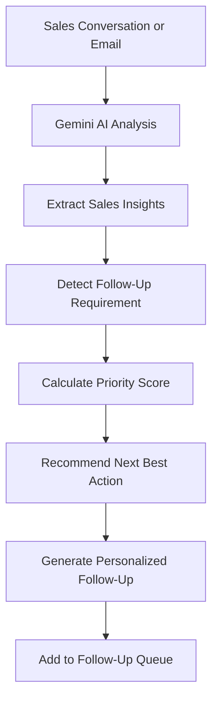

# FollowFlow AI 🚀

### AI-Powered Sales Follow-Up Agent

> Never let a valuable lead go cold.


---

## 📌 Project Overview

**FollowFlow AI** is an intelligent AI sales follow-up agent designed to convert sales conversations into structured, prioritized follow-up tasks. By analyzing sales call transcripts, meeting notes, and customer emails, FollowFlow AI eliminates manual review time, highlights high-intent opportunities, and protects deals from going cold.

Built for modern sales representatives and revenue leaders, FollowFlow AI continuously monitors customer intent, calculates dynamic priority scores, recommends the next best action, and drafts channel-specific, personalized outreach messages.

---

## 🔴 The Problem

Sales representatives communicate with dozens of prospects every week across multiple channels:

- 📞 **Sales Calls**: Complex discovery calls and multi-stakeholder discussions.
- 📧 **Emails**: Unstructured email threads with scattered questions and feedback.
- 🤝 **Meetings**: Demo recordings and meeting notes containing indirect buying signals.

Because of this overwhelming volume of communication:

- Follow-up commitments are frequently forgotten or lost in spreadsheets.
- Important prospects receive delayed responses, reducing conversion rates.
- High-intent leads gradually go cold without timely re-engagement.
- Sales teams struggle to accurately prioritize which prospect to contact first.
- Manually reviewing past conversations to draft context-aware emails is time-consuming.
- Generic, copy-paste follow-up templates result in low prospect response rates.

> Sales teams lose potential customers because important follow-ups are missed or delayed.

---

## 💡 The Solution

FollowFlow AI automates the entire follow-up workflow from conversation ingestion to tailored outreach generation.

```text
Sales Conversation / Email
        ↓
   AI Analysis
        ↓
Extract Customer Intent
        ↓
Detect Follow-Up Requirements
        ↓
Calculate Priority Score
        ↓
Recommend Next Best Action
        ↓
Generate Personalized Follow-Up
        ↓
Prioritized Follow-Up Queue
```

---

## ✨ Key Features

### 🤖 AI Conversation Analyzer

Paste unstructured sales call transcripts, meeting notes, or customer emails into FollowFlow AI to extract:

- **Lead Name & Company**: Automatically identified prospect identity.
- **Customer Intent**: Exact customer goal or buying stage.
- **Pain Points**: Specific operational challenges raised by the customer.
- **Objections**: Budget, approval, or technical integration hurdles.
- **Buying Signals**: Pricing requests, timeline inquiries, or feature requests.
- **Follow-Up Requirements & Urgency**: Deadlines and explicit response expectations.

### 📊 AI Lead Prioritization

Calculates a dynamic **Priority Score** from `0 to 100` based on purchase intent, urgency, objections, and deal risk:

- 🔴 **Critical (`90–100`)**: Strong purchase intent with urgent follow-up required.
- 🟠 **High (`75–89`)**: High interest and important follow-up actions.
- 🟡 **Medium (`50–74`)**: Moderate interest or routine follow-up.
- ⚪ **Low (`0–49`)**: Low engagement or no immediate response needed.

### 🧠 Next Best Action

Recommends the most strategic next step for every lead to accelerate deal velocity, such as:

- _Send Enterprise Plan pricing proposal by Friday_
- _Schedule technical architecture deep-dive_
- _Share compliance and security documentation_
- _Initiate re-engagement sequence_

### ✉️ AI Follow-Up Generator

Instantly crafts context-aware follow-up messages tailored to prospect details.

- **Supported Channels**: Email (with custom Subject Line), LinkedIn Message, WhatsApp Message.
- **Supported Tones**: Professional, Friendly, Concise, Persuasive.
- **Interactive Actions**: Regenerate alternative drafts, copy to clipboard, or mark follow-ups as sent.

### ⚠️ Lead Risk Detection

Proactively detects high-intent prospects who show signs of drop-off or delayed follow-ups before the deal goes cold.

### 📋 Follow-Up Queue

An interactive, AI-ranked queue sorting leads by urgency and opportunity size. Includes real-time status toggles, priority filtering, and instant state updates.

---

## ⚙️ AI Workflow



---

## 🛠️ Technology Stack

- **Frontend Framework**: [React 19](https://react.dev/) with [TypeScript](https://www.typescriptlang.org/)
- **Routing & Server Architecture**: [TanStack Start](https://tanstack.com/start/latest) & [TanStack Router](https://tanstack.com/router/latest)
- **Styling & UI Components**: [Tailwind CSS v4](https://tailwindcss.com/), [shadcn/ui](https://ui.shadcn.com/) (Radix UI primitives), [Lucide React](https://lucide.dev/)
- **Charts & Visualization**: [Recharts](https://recharts.org/)
- **AI Integration**: [Google Gemini API](https://ai.google.dev/) (`gemini-2.5-flash`, `gemini-2.0-flash`, `gemini-1.5-flash`)
- **Backend / Server Security**: Server Functions (`createServerFn` via `@tanstack/react-start`) in `src/lib/ai-functions.ts` executing securely on the server-side without exposing API keys.
- **Storage & State Persistence**: React Context Store (`src/lib/app-store.tsx`) with automatic `localStorage` synchronization for prototype state persistence across page refreshes.

---

## 📱 Application Pages

- 🏠 **Dashboard (`/`)**: Executive overview with active lead counts, follow-ups due today, high-priority opportunities, leads at risk, and top AI priority items.
- 📌 **Follow-Up Queue (`/follow-ups`)**: AI-ranked follow-up task management with filtering by priority (Critical, High, Medium, Low) and status toggles.
- 👥 **Leads Directory (`/leads`)**: Searchable list of all prospects, deal statuses, and intent indicators.
- 🔍 **Lead Details (`/leads/$leadId`)**: Deep-dive lead profile showing timeline events, extracted pain points, buying signals, and recommended actions.
- 🤖 **AI Conversation Analyzer (`/analyzer`)**: Input area with 1-click sample data loading to run Gemini AI analysis on raw transcripts.
- ✉️ **AI Follow-Up Generator (`/generator`)**: Custom message generator supporting Email, LinkedIn, WhatsApp, and tone selection.
- 🧠 **AI Insights (`/insights`)**: Strategic pipeline recommendations and deal health analytics.
- ⚙️ **Settings (`/settings`)**: System configuration and server-side API key verification.

---

## 🎬 Demo Workflow

1. Open the **FollowFlow AI Dashboard**.
2. Review the live **AI Priority Queue** and key pipeline statistics.
3. Navigate to the **AI Conversation Analyzer** (`/analyzer`).
4. Click **"Load Sample Data"** (or paste custom sales transcript notes).
5. Click **"Analyze with AI"**.
6. Gemini AI processes the text and extracts structured insights.
7. Review extracted pain points, objections, buying signals, and priority score (~96 Critical).
8. Click **"Add to Follow-Up Queue"** (persisted in `localStorage`).
9. Click **"Generate Personalized Message"** to open the AI Generator (`/generator`).
10. Select channel (Email) and tone (Professional), then click **"Copy"** or **"Mark as Sent"**.

---

## 📄 Sample AI Output

```json
{
  "leadName": "Sarah Johnson",
  "company": "Acme Corp",
  "interestLevel": "High",
  "customerIntent": "Evaluating Enterprise Plan",
  "painPoints": ["Workflow automation", "Reporting inefficiency", "Team scaling"],
  "objections": ["Requires finance approval"],
  "buyingSignals": ["Asked about Enterprise Plan pricing", "Requested implementation timeline"],
  "followUpRequired": true,
  "urgency": "High",
  "followUpDeadline": "Friday",
  "priorityScore": 96,
  "nextBestAction": "Send Enterprise Plan pricing details and schedule a follow-up call",
  "riskLevel": "High"
}
```

---

## 📂 Project Structure

```text
followflow-ai/
├── public/                 # Static assets
├── src/
│   ├── components/         # Reusable UI components & layouts
│   │   ├── ui/             # Radix / shadcn base primitives
│   │   ├── AppShell.tsx    # Main sidebar navigation & header layout
│   │   ├── PageHeader.tsx  # Header navigation bar
│   │   └── PriorityBadge.tsx # Priority badges & score meters
│   ├── hooks/              # Custom React hooks
│   │   └── use-mobile.tsx  # Mobile viewport detector
│   ├── lib/                # Core utilities, state & AI services
│   │   ├── ai-functions.ts # Server-side Gemini AI functions
│   │   ├── app-store.tsx   # React store with localStorage persistence
│   │   ├── mock-data.ts    # Initial leads & follow-up data
│   │   └── utils.ts        # Class merging & style helpers
│   ├── routes/             # TanStack file-based routing
│   │   ├── __root.tsx      # Root route layout wrapper
│   │   ├── index.tsx       # Executive Dashboard
│   │   ├── follow-ups.tsx  # AI Priority Queue
│   │   ├── analyzer.tsx    # AI Conversation Analyzer
│   │   ├── generator.tsx   # AI Follow-Up Message Generator
│   │   ├── leads/
│   │   │   ├── index.tsx   # Leads Directory
│   │   │   └── $leadId.tsx # Lead Details
│   │   ├── insights.tsx    # Strategic Insights
│   │   └── settings.tsx    # Settings & API status
│   ├── routeTree.gen.ts    # Generated route tree definitions
│   ├── router.tsx          # Router instantiation
│   ├── server.ts           # SSR server entry point
│   ├── start.ts            # TanStack Start initializer
│   └── styles.css          # Tailwind CSS global styles
├── eslint.config.js        # ESLint configuration
├── package.json            # Project dependencies & scripts
├── README.md               # Project documentation
├── tsconfig.json           # TypeScript configuration
└── vite.config.ts          # Vite build configuration
```

---

## 🚀 Installation & Setup

### Prerequisites

- **Node.js** (v18+ or v20+) and `npm` or `bun`

### 1. Clone Repository

```bash
git clone https://github.com/VIJAYAPANDIANT/followflow-ai.git
cd followflow-ai
```

### 2. Install Dependencies

```bash
npm install
```

### 3. Environment Setup

Create a `.env` file in the root directory:

```env
GEMINI_API_KEY=your_gemini_api_key_here
```

### 4. Run Development Server

```bash
npm run dev
```

Open your browser at `http://localhost:3000`.

---

## 🔐 Environment Variables

| Variable         | Description                                                                                | Required |
| ---------------- | ------------------------------------------------------------------------------------------ | -------- |
| `GEMINI_API_KEY` | Google Gemini API key used for server-side AI conversation analysis and message generation | Yes      |

---

## 🔒 Security

- **Server-Side API Key Protection**: The `GEMINI_API_KEY` is accessed exclusively inside server functions (`createServerFn` in `src/lib/ai-functions.ts`). It is never bundled into client JavaScript.
- **Git Safety**: Secrets are excluded via `.gitignore`. No API keys or tokens are stored in published commits.

---

## 🚀 Future Improvements

- 🔄 **CRM Integration**: Two-way sync with Salesforce, HubSpot, and Pipedrive.
- 📧 **Automated Email Sending**: Direct outreach execution via Gmail / Outlook APIs.
- 📅 **Calendar Sync**: Instant meeting scheduling via Google Calendar & Calendly.
- 🔔 **Real-Time Push Notifications**: Urgent alerts when high-intent leads are at risk of going cold.
- 👥 **Team Multi-Tenancy**: Multi-user authentication, workspace role assignment, and manager reports.
- 📈 **Historical Deal Analytics**: Machine learning model refinement based on historical deal win/loss rates.

---

## 🏆 Hackathon Context

Built for **AI Product Hackathon '26** — A 2-day AI product buildathon focused on creating practical, high-impact AI products from initial problem validation to a fully working prototype.

---

## 👤 Author

**Vijayapandian T**

- **GitHub**: [https://github.com/VIJAYAPANDIANT](https://github.com/VIJAYAPANDIANT)
- **Repository**: [https://github.com/VIJAYAPANDIANT/followflow-ai](https://github.com/VIJAYAPANDIANT/followflow-ai)

---

## 📜 License

This project is created for educational and hackathon purposes.
