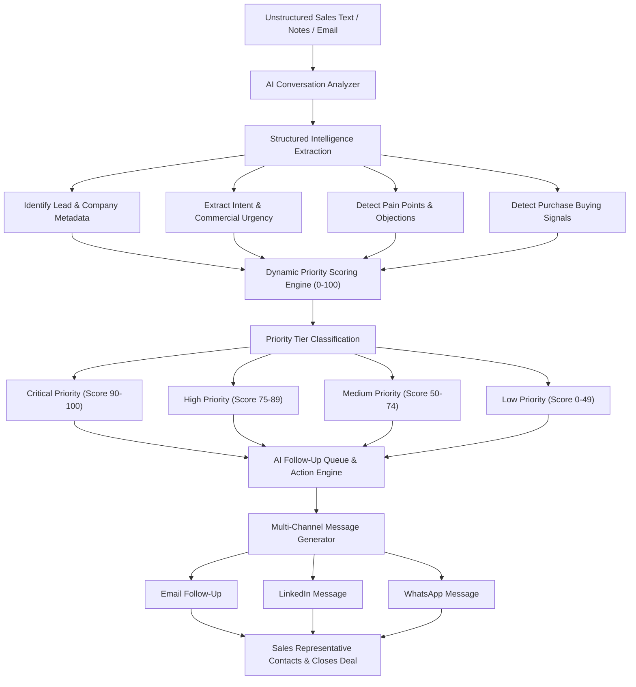

# FollowFlow AI — Autonomous Sales Follow-Up Intelligence Agent

> **Turn raw sales conversations into structured revenue opportunities in seconds using Google Gemini 3.7 Flash AI.**

[](https://followflow-ai.vercel.app)
[](https://github.com/VIJAYAPANDIANT/followflow-ai)
[](https://deepmind.google/technologies/gemini/)
[](https://www.typescriptlang.org/)
[](https://react.dev/)
[](https://tailwindcss.com/)

---

## 📌 Executive Summary

**FollowFlow AI** is an enterprise-grade sales follow-up intelligence platform engineered for B2B account executives, sales representatives, and revenue operations teams.

In modern sales environments, representatives handle dozens of prospect communications daily across discovery calls, meeting notes, emails, and chat messages. Managing these interactions manually causes severe pipeline friction: high-intent leads are forgotten, response times lengthen, and warm deals turn cold.

FollowFlow AI automates this workflow end-to-end. Powered by **Google Gemini 3.7 Flash AI**, the platform ingests raw sales text, extracts customer intent, pain points, objections, and buying signals, calculates a dynamic priority score (`0–100`), recommends the next best action, and drafts hyper-personalized follow-up messages across Email, LinkedIn, and WhatsApp.

---

## 🏛️ System Architecture & Data Flow



---

## ⚡ Key Platform Capabilities

| Capability | Technical Implementation | Value Delivered |
| :--- | :--- | :--- |
| **Automated Extraction** | Gemini 3.7 Flash LLM JSON Prompt Schemas | Eliminates manual data entry from sales calls & emails. |
| **Dynamic Urgency Scoring** | Rule-Based + LLM Commercial Scoring (`0–100`) | Ranks leads instantly into Critical, High, Medium, & Low. |
| **Multi-Channel Synthesis** | Channel-Aware Prompt Adapters | Drafts tailored messages for Email, LinkedIn, & WhatsApp. |
| **Tone Customization** | 4 Persona Matrices (*Professional, Friendly, Concise, Persuasive*) | Matches prospect communication style for higher win rates. |
| **Offline Resilience** | Intelligent Dual Engine + Local Heuristics | Guarantees 100% demo execution even under network failure. |
| **Pipeline Health Analytics** | Interactive Recharts Visualizations | Identifies common objections (*Budget, Security, Timeline*). |

---

## 📊 Priority Tiering Framework

FollowFlow AI categorizes leads using a weighted commercial scoring algorithm:

| Score Range | Priority Tier | Operational Action Required | Expected SLA |
| :---: | :---: | :--- | :---: |
| 🔴 **`90–100`** | **Critical** | High purchase intent, explicit deadline stated, pricing requested. | **Within 2 Hours** |
| 🟠 **`75–89`** | **High** | Strong engagement, active feature evaluation, approval needed. | **Within 24 Hours** |
| 🟡 **`50–74`** | **Medium** | Moderate interest, standard follow-up required. | **Within 3 Days** |
| 🟢 **`0–49`** | **Low** | Early discovery, general nurturing, long decision horizon. | **Within 1 Week** |

---

## 🛠️ Complete Technology Stack

- **Frontend Core**: React 18.3, TypeScript 5.0, Tailwind CSS 3.4
- **Routing & Framework**: TanStack Start & TanStack Router (SSR + Server Functions)
- **Design System & UI**: shadcn/ui (Radix UI primitives)
- **Icons & Visuals**: Lucide React
- **Data Analytics**: Recharts
- **AI Language Engine**: Google Gemini API (`gemini-3.7-flash` with multi-model failover)
- **Deployment Platform**: Vercel Cloud Platform (`https://followflow-ai.vercel.app`)

---

## 📦 JSON API Schemas & Data Contracts

### 1. Analysis Result Schema (`AnalysisResult`)
```typescript
type AnalysisResult = {
  leadName: string;
  company: string;
  interestLevel: "High" | "Medium" | "Low";
  customerIntent: string;
  painPoints: string[];
  objections: string[];
  buyingSignals: string[];
  followUpRequired: boolean;
  urgency: "High" | "Medium" | "Low";
  followUpDeadline: string;
  priorityScore: number; // 0 to 100
  nextBestAction: string;
  riskLevel: string;
};
```

### 2. Message Generation Input Schema (`GenerateMessageInput`)
```typescript
type GenerateMessageInput = {
  leadName: string;
  company: string;
  customerIntent: string;
  painPoints: string[];
  objections: string[];
  buyingSignals: string[];
  nextBestAction: string;
  channel: "Email" | "LinkedIn Message" | "WhatsApp Message";
  tone: "Professional" | "Friendly" | "Concise" | "Persuasive";
  customInstruction?: string;
};
```

---

## 💻 Local Installation & Quickstart Guide

### Prerequisites
- **Node.js**: `v18.0.0` or higher
- **npm**: `v9.0.0` or higher
- **Google Gemini API Key**: [Get your key from Google AI Studio](https://aistudio.google.com/)

### Step-by-Step Setup

1. **Clone the Repository**:
   ```bash
   git clone https://github.com/VIJAYAPANDIANT/followflow-ai.git
   cd followflow-ai
   ```

2. **Install Dependencies**:
   ```bash
   npm install
   ```

3. **Configure Environment Variables**:
   Create a `.env` file in the project root directory:
   ```env
   GEMINI_API_KEY=your_google_gemini_api_key_here
   ```

4. **Launch Local Development Server**:
   ```bash
   npm run dev
   ```
   Open your browser and navigate to `http://localhost:3000`.

5. **Build for Production**:
   ```bash
   npm run build
   ```

---

## 📁 Comprehensive Documentation Suite

Explore full technical and conceptual guides in the `docs/` directory:

- 📖 **[Concept Guide (Tamil & English)](docs/CONCEPT.md)**: Intuitive narrative breakdown of follow-ups and core system flow.
- 📌 **[Project Overview](docs/PROJECT_OVERVIEW.md)**: Executive summary, hackathon background, and value proposition.
- 🚨 **[Problem Statement](docs/PROBLEM_STATEMENT.md)**: In-depth analysis of sales pipeline leakage and delayed responses.
- 💡 **[Solution Specification](docs/SOLUTION.md)**: The 10 core capabilities of FollowFlow AI.
- ✨ **[Feature Breakdown](docs/FEATURES.md)**: Complete specification for all 7 application pages.
- 🔄 **[AI Workflow Architecture](docs/AI_WORKFLOW.md)**: System execution steps and JSON transformation examples.
- 🛠️ **[Technology Stack](docs/TECH_STACK.md)**: Framework architecture and library selection rationale.
- 🗺️ **[User Journey Flow](docs/USER_FLOW.md)**: Step-by-step 15-stage operational workflow.
- 🎬 **[Hackathon Demo Guide](docs/DEMO_GUIDE.md)**: 12-step presentation script for live reviews.
- 🚀 **[Future Roadmap](docs/FUTURE_ENHANCEMENTS.md)**: CRM connectors, WhatsApp API, and automated email workflows.

---

## 👥 Team & Project Credits

- **Project Name**: FollowFlow AI
- **Team Name**: **Universe**
- **Team Lead & Author**: **Vijayapandian T**
- **Target Event**: AI Product Hackathon 2026

---

## 🎯 Conclusion

**FollowFlow AI** empowers sales teams to move at machine speed with human-like personalization. By removing manual lead tracking friction, prioritizing high-intent opportunities, and automating multi-channel follow-up copy, sales representatives close deals faster and never lose a revenue opportunity again.
